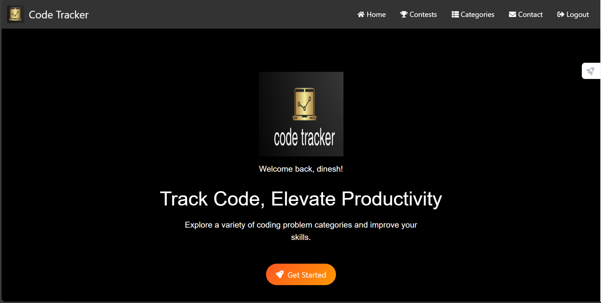
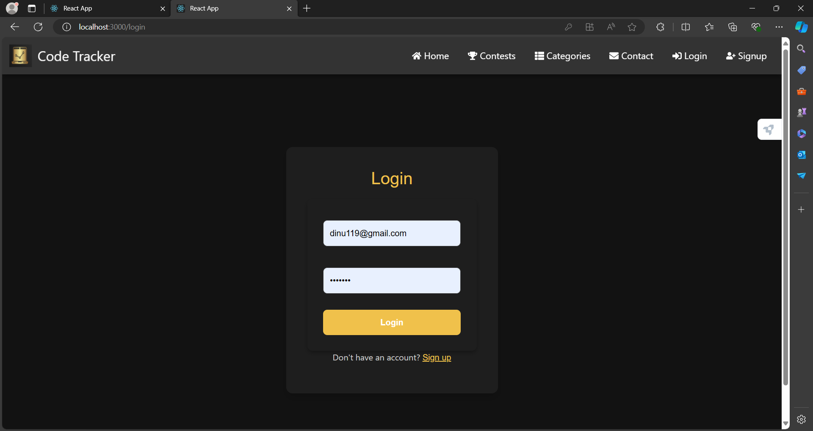
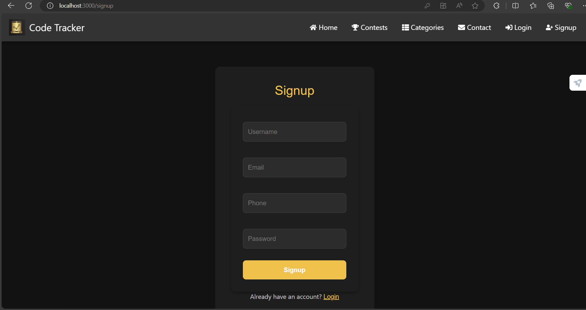
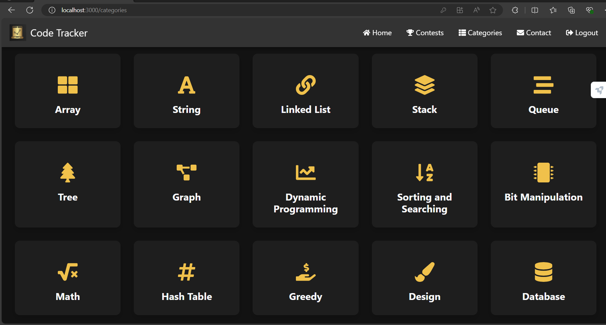
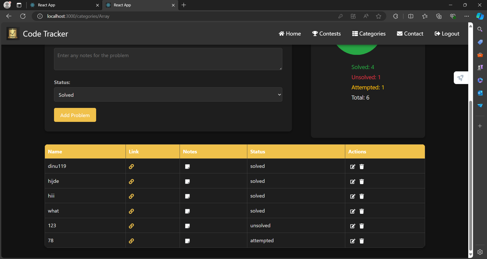
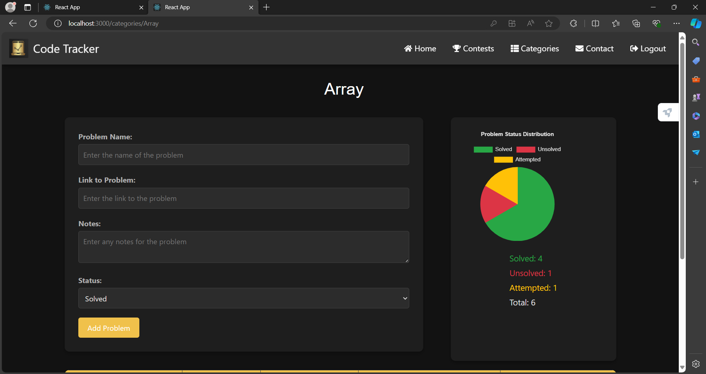
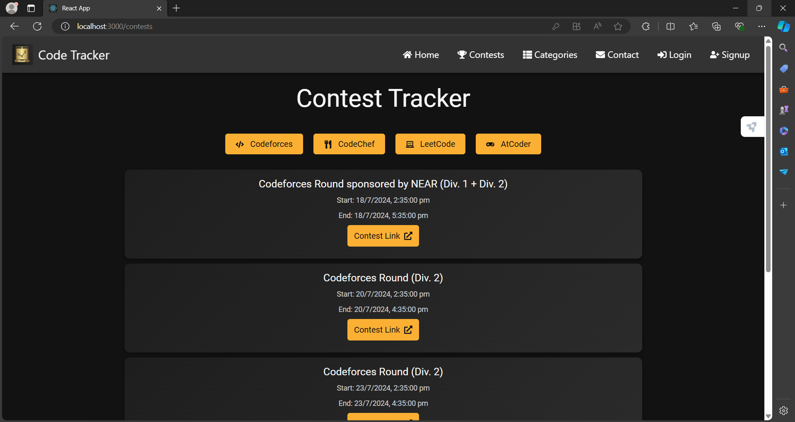
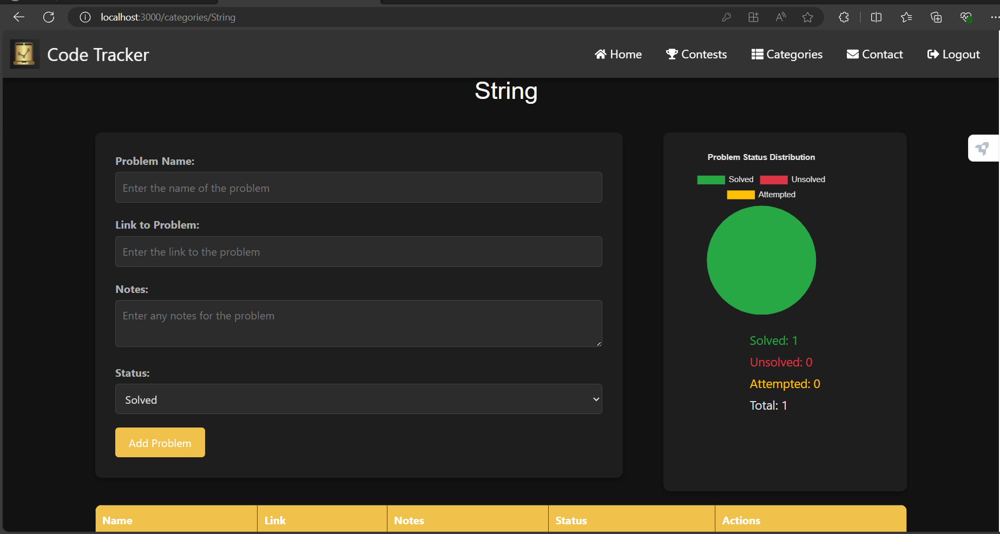

# MERN Stack Code Tracker

Welcome to the MERN Stack Code Tracker! This project is designed to help you manage and track your code effectively using a modern tech stack: MongoDB, Express.js, React, and Node.js.

## Features

- User Authentication
- Problem Categories
- Dashboard
- Image Compression for Uploads
- Beautiful UI with Styled-Components

## Screenshots

### Home Page


### Login Page


### Signup Page


### Problem Categories


### Array Problem List


### Array Problems


### Contest Schedule


### String Problems


## Installation

1. Clone the repository:
   ```bash
   git clone https://github.com/your-username/mern-code-tracker.git
